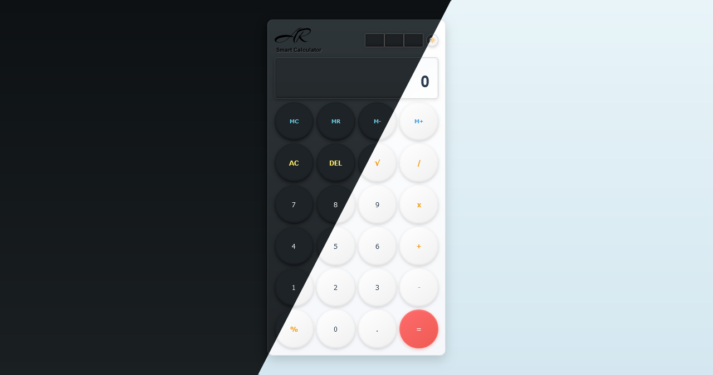

# 🎓 Smart Calculator

<p> 


</p>


---

A modern, responsive, and feature-rich **Smart Calculator** with **Dark/Light Theme** support built with **HTML, CSS, and JavaScript**.  
Designed to resemble a classic solar-powered calculator with a sleek interface, smooth animations, memory functions, and auto theme detection.

---

## 🔹 Features

### 🎨 Theme System
- **Dark & Light Mode**: Toggle between stunning dark and light themes
- **Auto Theme Detection**: Automatically adapts to your system preference
- **Theme Persistence**: Remembers your theme choice across sessions
- **Smooth Transitions**: Beautiful animations when switching themes
- **SVG Icons**: Professional Material Design icons for theme toggle

### 🧮 Calculator Functions
- **Basic Operations**: `+ - * /`
- **Advanced Functions**:
  - Square Root `√`
  - Percentage `%`
  - Toggle Sign `±`
- **Memory Functions**:
  - **M+**: Add to memory
  - **M-**: Subtract from memory
  - **MR**: Recall memory
  - **MC**: Clear memory
  - **Memory Indicator**: Visual "M" indicator when memory is active
- **Numbers & Decimal**: `0-9` and `.`
- **Clear Functions**: `AC` (All Clear), `DEL` (Delete last digit)

### 📱 Responsive Design
- **Universal Compatibility**: Works perfectly on all devices with optimized breakpoints
  - 📱 **Extra Small Phones** (up to 360px) - Ultra compact layout
  - 📱 **Small Phones** (361px - 420px) - Optimized mobile view
  - 📱 **Medium Phones** (421px - 767px) - Standard mobile layout
  - 📱 **Tablets** (768px - 1024px) - Perfect for iPad and tablets
  - 💻 **Laptops** (1025px - 1919px) - Desktop comfortable view
  - 🖥️ **4K & Large Displays** (1920px+) - Enhanced for big screens
  - 📺 **TV Screens** - Optimized for large displays
- **Landscape Support**: Special optimization for landscape and short-height devices (< 600px)
- **Smart Scaling**: All elements scale perfectly with screen size using precise media queries
- **No Overflow**: Content always fits within viewport with proper spacing
- **Precise Breakpoints**: 7 different responsive breakpoints for pixel-perfect display

### ⌨️ Keyboard Support
- **Numbers**: `0-9`
- **Decimal**: `.`
- **Operators**: `+ - * / %`
- **Actions**:
  - `Enter` or `=` → Calculate result
  - `Backspace` → Delete last digit
  - `Escape` or `C` → Clear all
  - `N` → Toggle negative
  - `S` or `R` → Square root
- **Shift Shortcuts**:
  - `Shift + 5` → `%`
  - `Shift + =` → `+`

### 🎯 UI/UX Features
- **Live Formula Display**: Shows full calculation above result
- **Auto Scroll**: Long numbers scroll automatically
- **Error Handling**: Invalid expressions show "Error" and auto-reset
- **Button Feedback**: Realistic 3D press effects
- **Solar Panel Design**: Authentic calculator aesthetic
- **Memory Indicator**: Visual feedback for memory operations
- **Smooth Animations**: Polished hover and click effects

---

## 📂 Project Structure

```
Smart-Calculator/
├── index.html         # Main HTML structure
├── style.css          # Styling with responsive layout & themes
├── script.js          # Calculator logic & functionality
├── README.md          # Project documentation
└── LICENSE            # MIT License
```

---
## 📁 File Structure Details

### index.html (Structure)
- Semantic HTML5 markup
- Calculator layout with header, display, and button grid
- Links to external `style.css` and `script.js`
- SVG logo and theme toggle icons

### style.css (Styling)
- CSS Variables for easy theming
- Complete dark and light theme definitions
- 7 responsive breakpoints for all devices
- Grid-based button layout
- Smooth transitions and animations
- Solar panel and realistic button effects

### script.js (Functionality)
- Calculator logic and operations
- Memory functions (M+, M-, MR, MC)
- Keyboard event handling
- Theme detection and switching
- LocalStorage for theme persistence
- Error handling and validation

## 💻 Installation & Usage

### Method 1: Direct Download

1. **Download the repository:**
```bash
git clone https://github.com/abdurrahman101bd/Smart-Calculator.git
cd Smart-Calculator
```

2. **Open the project:**
   - Simply open `index.html` in your browser
   - All CSS is in `style.css` and JavaScript in `script.js`
   - No server or build process required!

### Method 2: GitHub Pages

Visit the live demo directly (no download needed).

---

## 🌐 Live Demo

Try the calculator now:  

[](https://abdurrahman101bd.github.io/Smart-Calculator)

---

## 🎨 Screenshots


### SMART CALCULATOR 


---

## 🎨 Customization

### Colors & Theme Variables

#### Dark Theme (Default)
Modify CSS variables in `:root` section of `style.css`:
```css
:root {
  --bg: #222831;
  --panel: #2b3136;
  --button: #1e2327;
  --yellow: #f6e96b;
  --accent: #ff5c38;
  --border: rgba(255,255,255,0.1);
}
```

#### Light Theme
Light theme colors are defined in `body.light-mode` class. Key colors:
```css
body.light-mode {
  background: linear-gradient(180deg, #e8f4f8, #d4e7f0);
}
/* Buttons */
.btn.ghost { color: #e67e22; }  /* AC, DEL */
.btn.op { color: #f39c12; }     /* Operators */
.btn.memory { color: #3498db; }  /* Memory buttons */
```

### Component Styling

Located in `style.css`:
- **Header / Solar Panels**: `.power` divs for authentic calculator look
- **Theme Toggle**: `.theme-toggle` button with SVG icons
- **Display**: `.display` with formula and result sections
- **Buttons**: Various classes:
  - `.btn` - Normal number buttons
  - `.btn.eq` - Equal button (gradient red)
  - `.btn.op` - Operator buttons (yellow)
  - `.btn.ghost` - AC, DEL buttons (yellow)
  - `.btn.memory` - Memory function buttons (cyan)
- **Memory Indicator**: `.memory-indicator` shows when memory has value

### Responsive Breakpoints

Easily adjust breakpoints in `style.css`:
```css
@media (max-width: 360px) { /* Extra small phones */ }
@media (min-width: 361px) and (max-width: 420px) { /* Small phones */ }
@media (min-width: 421px) and (max-width: 767px) { /* Medium phones */ }
@media (min-width: 768px) and (max-width: 1024px) { /* Tablets */ }
@media (min-width: 1025px) and (max-width: 1919px) { /* Laptops */ }
@media (min-width: 1920px) { /* 4K displays */ }
@media (max-height: 600px) { /* Landscape mode */ }
```

---

## ⚡ Technical Highlights

### Performance
- **Lightweight**: Total size under 100KB (HTML + CSS + JS combined)
- **Zero Dependencies**: Pure vanilla JavaScript, no frameworks
- **Fast Load**: Instant page load with optimized file structure
- **Efficient**: Optimized calculations and minimal DOM updates
- **Modular Code**: Separated HTML, CSS, and JavaScript files for better maintainability

### Code Quality
- **Clean Code**: Well-organized and commented
- **ES6+**: Modern JavaScript features
- **Responsive**: Mobile-first design approach with 7 breakpoints
- **Cross-browser**: Works on all modern browsers
- **Modular Structure**: Separated HTML, CSS, and JavaScript files
- **Maintainable**: Easy to customize and extend

### Smart Features
- **System Theme Detection**: Uses `prefers-color-scheme` media query
- **LocalStorage**: Theme preference persistence across sessions
- **Precise Responsive Design**: 7 carefully crafted breakpoints:
  - Up to 360px (Extra small phones)
  - 361px - 420px (Small phones)
  - 421px - 767px (Medium phones)
  - 768px - 1024px (Tablets)
  - 1025px - 1919px (Laptops)
  - 1920px+ (4K displays)
  - Height < 600px (Landscape mode)
- **Grid Layout**: Perfect button alignment on all screens
- **CSS Variables**: Easy theme customization
- **Smooth Transitions**: Polished animations throughout

---

## 🛠 Built With

- **HTML5**: Semantic markup structure
- **CSS3**: 
  - Flexbox & Grid layouts
  - CSS Variables for theming
  - Linear Gradients & Box Shadows
  - 7 Responsive breakpoints with Media Queries
  - Smooth transitions and animations
  - Mobile-first approach
- **JavaScript (ES6+)**:
  - Event handling (click & keyboard)
  - LocalStorage API for preferences
  - MediaQuery API for theme detection
  - Dynamic DOM manipulation
  - Modular function structure

---

## 📖 How to Use

### Basic Operations
1. Click number buttons or type on keyboard
2. Use operator buttons for calculations
3. Press `=` or `Enter` to get result
4. Use `AC` to clear all or `DEL` to delete last digit

### Memory Functions
1. **M+**: Adds current display value to memory
2. **M-**: Subtracts current value from memory
3. **MR**: Recalls memory value to display
4. **MC**: Clears memory (indicator disappears)
5. **Memory Indicator**: "M" appears when memory has value

### Theme Switching
1. Click the moon/sun icon in top-right
2. Or let it auto-detect your system preference
3. Your choice is saved automatically

### Advanced Functions
1. **Square Root**: Click `√` or press `S/R`
2. **Percentage**: Click `%` or press `%`
3. **Toggle Sign**: Click `±` or press `N`

---

## 🔧 Browser Support

- ✅ Chrome (90+)
- ✅ Firefox (88+)
- ✅ Safari (14+)
- ✅ Edge (90+)
- ✅ Opera (76+)
- ✅ Mobile browsers (iOS Safari, Chrome Mobile)

---

## 📢 Contributions

Contributions, issues, and feature requests are welcome!

1. Fork the project
2. Create your feature branch (`git checkout -b feature/AmazingFeature`)
3. Commit your changes (`git commit -m 'Add some AmazingFeature'`)
4. Push to the branch (`git push origin feature/AmazingFeature`)
5. Open a Pull Request

---

## 🐛 Known Issues

None currently! Report issues [here](https://github.com/abdurrahman101bd/Smart-Calculator/issues).

---

## 📝 Changelog

### Version 2.0 (Current)
- ✨ Added Dark/Light theme toggle
- ✨ System theme auto-detection
- ✨ Memory functions (M+, M-, MR, MC)
- ✨ Square root function
- ✨ Improved responsive design for all devices
- ✨ Better keyboard support
- ✨ Enhanced UI with smooth animations

### Version 1.0
- 🎉 Initial release
- Basic calculator functions
- Dark theme UI
- Keyboard support

---

## 🔖 License

This project is licensed under the [MIT License](LICENSE).

---

## 🎯 Author

**Abdur Rahman**

[](https://github.com/abdurrahman101bd)
[](mailto:abdurrahman101bd@gmail.com)

Modern Smart Calculator for web and mobile, designed with passion for minimalism and usability.

---

## 🌍 Connect With Me

[](https://github.com/abdurrahman101bd)
[](https://www.linkedin.com/in/abdurrahman101bd)
[](https://x.com/abdurrahman101b)
[](https://www.facebook.com/abdurrahman101bd)

---

## 💡 Future Enhancements

- [ ] Scientific calculator mode
- [ ] Calculation history
- [ ] Export calculations
- [ ] Custom color themes
- [ ] Haptic feedback on mobile
- [ ] Sound effects toggle
- [ ] Multiple calculator layouts

---

## ⭐ Show Your Support

Give a ⭐️ if this project helped you!

---

## 📊 Stats


---

⌛ **Enjoy your Smart Calculator!** ⌛

Made with ❤️ by [Abdur Rahman](https://github.com/abdurrahman101bd)

---

